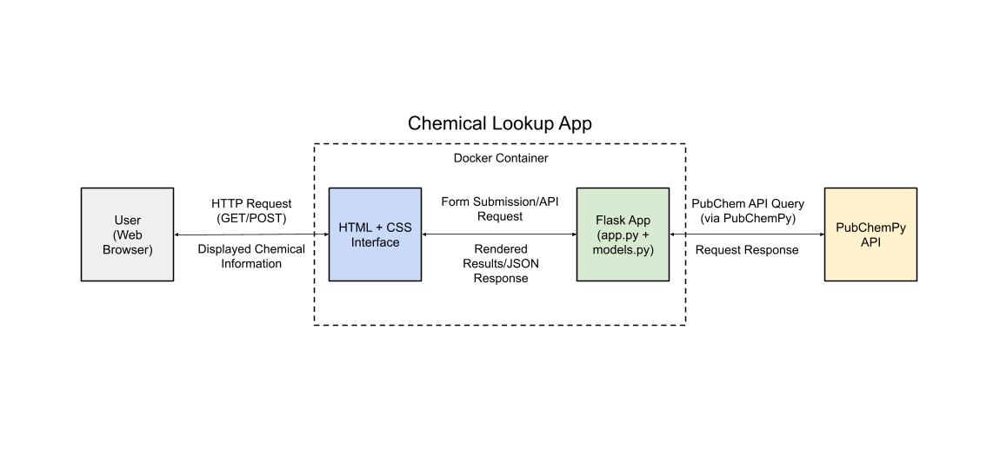
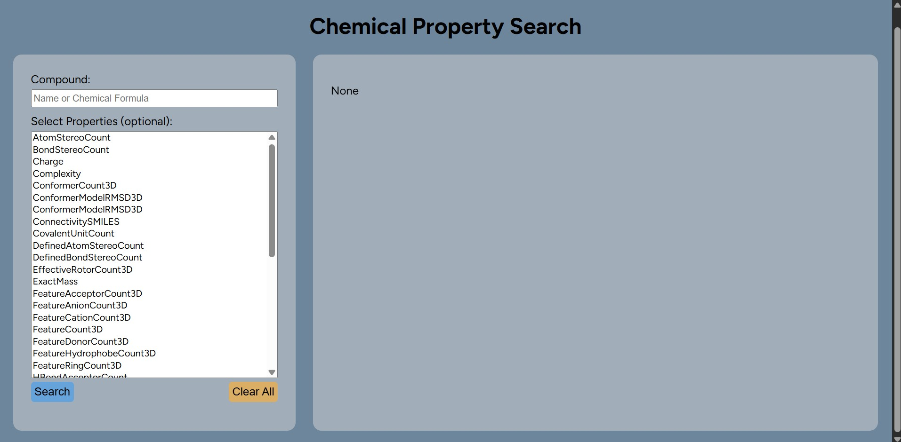
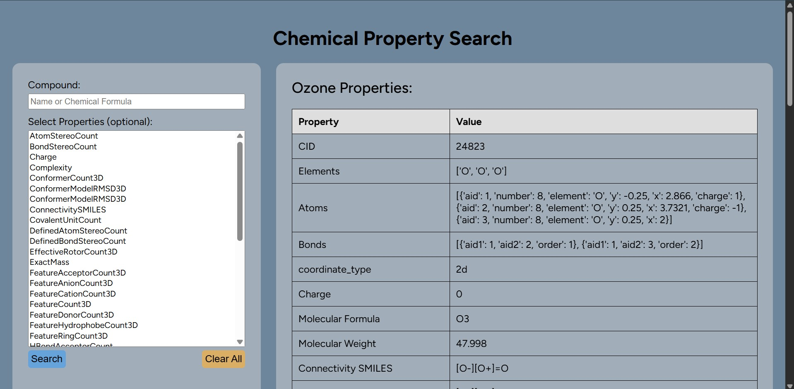

# 1) Executive Summary

**Problem:** Finding detailed chemical properties for compounds/chemicals requires several searches and one to reference multiple databases to find a definite answer. Often, there are several similar answers requiring a decision of which is the best and a simple task takes very long. This is a problem for all chemists alike both students and professionals.

**Solution:** The solution is a web app where users enter a compound name or formula and select the desired properties. The app responds back with a table of results containing the properties and values. The app uses the PubChem chemical database from the National Library of Medicine to return a definite answer from a multitude of sources, so the search is already done for the user.

# 2) System Overview

#### **Course Concept:** Flask API

#### **Architecture Diagram:** 

{fig-align="left"}

#### **Data/Models/Services:** 

-   **Source:** PubChem Chemical Database via PubChemPy Python Library

-   **Size:** Small (fetches only single compounds properties as dictionary)

-   **Format:** Python dictionary returned to HTML

-   **License:** MIT License (Mark Swain 2014-2025). Permission is granted, free of charge, to use a copy of this software without limitation to the rights to use, modify, merge, publish, distribute, sublicense, and/or sell copies as long as the copyright notice is included. The software is provided "as-is" with no warranty.

# 3) How to Run (Local)

**Docker**

``` bash
# build the Docker image
docker build -t chemical-lookup:latest .

# run the container
docker run --rm -p 5000:5000 chemical-lookup:latest

# health check
curl http://localhost:5000/health
```

or

``` bash
chmod +x run.sh
./run.sh
```

# 4) Design Decisions

#### **Why this concept?** 

I choose Flask, as it easily integrates with Python and PubChemPy since it is a Python-based library. Flask allows easy and rapid app development along with the integration of backend Python logic which is at the core of this project.

#### **Tradeoffs:**

Performance: It is lightweight and suitable for small queries, but is not optimized for large datasets.

#### **Security/Privacy:**

No sensitive data is collected or stored so no PII handling is required.

Requests are sent through PubChem servers, evaluated, and then a response is sent back, so confidential work is not the best for this. The data sent back is publicly available.

Input validation is present but minimal and could be expanded to prevent malicious queries.

No secrets are necessary for PubChemPy.

#### **Ops:**

-   **Deployment:** Docker container allows for simple deployment of app and ensures a consistent environment across machines.

-   **Logging/Metrics:** Logs can be accessed through Flask's debug mode during development. Proper logging and metrics could be added through production deployment.

-   **Scaling Considerations:** Currently single-threaded on Flask which allows one request at a time, so for scaling a WSGI server like Gunicorn would be needed to handle multiple queries at once.

-   **Known Limitations:** Dependent on PubChemPy REST API, so requires an internet connection to work and real-time API calls may fail is service is unavailable. There is no caching or support for multiple requests either at this point.

# 5) Results and Evaluation

#### **Sample Output:**

Homepage

{width="1914"}

Ozone Search Results



#### **Performance Notes:**

-   **Speed:** Response time is \~1 second or less.

    -   Dependent on PubChemPy API

        -   Contains over 300 million substance records and over 100 million standardized compound records

-   **Reliability:** System returns consistent results for valid compounds and handles invalid inputs properly.

-   **Scalability:** Suitable for small workloads

    -   Deals with one request at a time

-   **Efficiency:** Very lightweight

    -   Flask requires minimal CPU and memory

    -   Docker is negligible

#### **Validation:**

**Test Performed**

1.  Health Check
    -   `curl http://localhost:5000/health`

    -   Confirms:

        -   Flask is running

        -   Docker exposes correct port

        -   Server returns JSON response: `{"status":"okay"}`
2.  Functional Tests
    -   Valid compound name or formula entered (lookup functions) ⟶ returns proper compound identification variable

    -   Invalid compound name or formula entered (lookup functions) ⟶ returns None

    -   Valid compound name or formula entered (search function) ⟶ returns python dictionary of all compound properties

    -   Invalid compound name or formula entered (search function) ⟶ returns None

    -   Invalid compound name or formula entered (filter function) ⟶ returns "Please Enter Name or Formula Again"

    -   No query (filter function) ⟶ returns complete dataset for compound with cleaned labels

    -   Single-field queries (ex. molecular_weight) (filter function) ⟶ returns correctly filtered dataset

    -   Multi-field queries (filter function) ⟶ returns correct subset of properties from dataset
3.  Integration Tests
    -   Web Browser ⟶ HTML Form ⟶ Flask App ⟶ PubChemPy API ⟶ Rendered HTML

    -   Checked with multiple compounds to confirm proper HTML renders

# 6) What's Next

#### **Planned Improvements / Refactors:**

-   Implement caching to improve response time and reduce PubChem API calls

-   Enhance input validation

-   Add logging and monitoring for operational insights in production

#### Stretch Features:

-   Support batch queries (multiple compounds at once)

-   Add advanced filtering and sorting in results table

-   Provide downloadable CSV output of results

# 7) Links

**Github:** <https://github.com/Prishab50/Chemical-Property-Lookup>